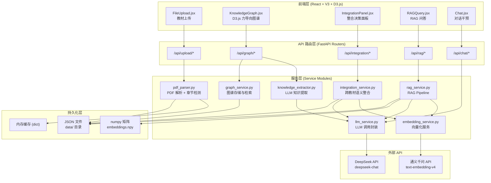
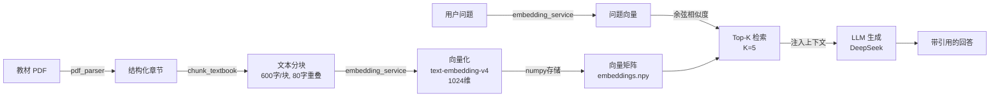
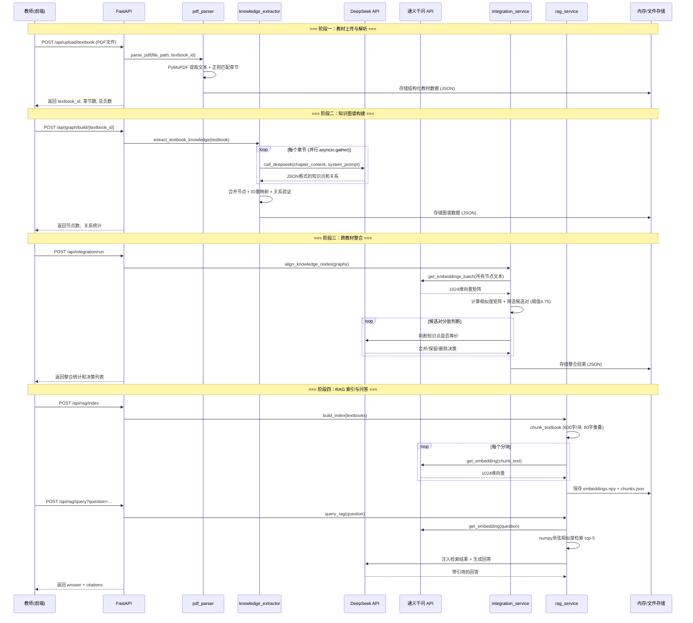

# Agent 架构说明文档

> 本文档详细阐述"学科知识整合智能体"的系统架构设计、技术选型依据、核心算法思路及工程权衡，旨在为评审提供完整的技术决策链条。

---

## 1. 架构总览

### 1.1 系统定位

本系统面向**医学教育场景**，解决多本教材之间知识点重复、表述不一致、缺乏跨学科整合的问题。系统以智能体（Agent）形态运行，接收教师上传的 PDF 教材，自动完成知识提取、跨教材语义对齐与整合、以及基于检索增强生成（RAG）的问答服务。

### 1.2 整体架构

系统采用**单 Agent + 模块化服务**架构，后端以 FastAPI 为骨架，前端以 React + V3 + D3.js 构建交互层，通过 RESTful API 进行前后端通信。



### 1.3 技术栈一览

| 层次 | 技术选型 | 说明 |
|------|----------|------|
| 后端框架 | FastAPI (Python) | 异步原生支持，自动生成 OpenAPI 文档 |
| 前端框架 | React + V3 (Vite) | 快速开发，热更新 |
| 可视化 | D3.js | 力导向图（Force-Directed Graph）渲染知识图谱 |
| LLM 服务 | DeepSeek API (`deepseek-chat`) | 中文理解能力强，性价比高 |
| Embedding 服务 | 通义千问 `text-embedding-v4` | 1024 维向量，中文语义表征优秀 |
| 向量检索 | NumPy 余弦相似度 | 轻量级，无需额外依赖 |
| PDF 解析 | PyMuPDF (fitz) | 速度快，支持文本和元数据提取 |
| 存储方案 | 内存缓存 + JSON 文件持久化 | 适配 Serverless 冷启动场景 |

---

## 2. 设计决策论证

### 2.1 单 Agent vs 多 Agent 架构

在架构选型阶段，我们对比了两种方案：

**方案 A：单 Agent + 模块化服务（最终采用）**

```
用户请求 → FastAPI Router → 对应 Service Module → 外部 API
```

**方案 B：多 Agent 协作**

```
用户请求 → Orchestrator Agent → [Parser Agent, Extractor Agent, Integrator Agent, RAG Agent]
```

**决策理由：**

| 维度 | 单 Agent + 模块化 | 多 Agent 协作 |
|------|-------------------|---------------|
| 开发复杂度 | 低：函数调用，同步/异步可控 | 高：需设计 Agent 间通信协议、消息队列 |
| 调试难度 | 低：单进程，栈追踪清晰 | 高：分布式调试，需 Agent 状态追踪 |
| 延迟开销 | 低：进程内函数调用 | 高：Agent 间序列化/反序列化、网络通信 |
| 故障隔离 | 中：模块间有明确接口 | 高：单 Agent 崩溃不影响其他 |
| 可扩展性 | 中：垂直扩展为主 | 高：可独立水平扩展各 Agent |

**核心判断**：本系统的五个核心流程（解析、提取、整合、RAG、对话）是**线性编排关系**，而非需要并行协商的多智能体场景。使用多 Agent 架构会引入不必要的通信开销和状态管理复杂度，而单 Agent 通过模块化设计已能实现同等的职责隔离。

### 2.2 模块化服务的具体设计

每个服务模块遵循**单一职责原则**：

- **pdf_parser.py**：仅负责 PDF 文件解析和章节检测，输出结构化的教材数据
- **knowledge_extractor.py**：仅负责调用 LLM 提取知识点和关系，不关心存储细节
- **integration_service.py**：仅负责跨教材的语义对齐和整合决策
- **rag_service.py**：仅负责 RAG Pipeline 的完整流程（分块、索引、检索、生成）
- **embedding_service.py**：封装通义千问 API 调用，提供统一的向量化接口
- **llm_service.py**：封装 DeepSeek API 调用，处理 JSON 解析和错误重试

模块间通过**函数调用**传递数据，通过**全局变量 + 文件持久化**共享状态。这种设计在开发速度和代码可维护性之间取得了平衡。

---

## 3. Prompt 工程设计

### 3.1 知识提取 Prompt

知识提取是整个系统的数据源头，Prompt 的质量直接决定知识图谱的质量。

**System Prompt 设计要点：**

```
你是一个医学知识提取专家。你需要从教材章节中提取核心知识点和它们之间的关系。

要求：
1. 提取该章节中的核心知识点（概念、定理、方法、现象等）
2. 识别知识点之间的关系
3. 输出严格的JSON格式
```

**关键设计决策：**

1. **角色锚定**：以"医学知识提取专家"作为角色定位，引导 LLM 进入专业领域的推理模式
2. **结构化输出约束**：明确定义 JSON Schema，包含 `nodes` 和 `relations` 两个顶层字段
3. **关系类型枚举**：预定义四种关系类型（prerequisite / parallel / contains / applies_to），避免 LLM 自由发挥导致的类型混乱
4. **数量约束**：要求每个章节提取 10-20 个知识点、8-15 条关系，既避免提取不足，也避免过度提取噪声节点
5. **粒度约束**：定义不超过 100 字，确保简洁准确

**节点输出格式示例（Few-Shot）：**

```json
{
  "nodes": [
    {
      "id": "node_001",
      "name": "知识点名称",
      "definition": "简洁的定义或描述",
      "category": "核心概念|生理机制|病理变化|临床表现|治疗方法|解剖结构",
      "chapter": "章节标题",
      "page": 页码
    }
  ],
  "relations": [
    {
      "source": "node_001",
      "target": "node_002",
      "relation_type": "prerequisite|parallel|contains|applies_to",
      "description": "关系描述"
    }
  ]
}
```

**输入 Prompt（User Prompt）：**

```
请从以下教材章节中提取核心知识点和关系：

教材：{textbook_name}
章节：{chapter_title}
页码：{page_start}-{page_end}

章节内容：
{chapter_content[:8000]}

请按照系统提示中的JSON格式输出知识点和关系。
```

**设计细节：**
- 章节内容截断至 8000 字符，避免超出 LLM 上下文窗口
- 将教材名称、章节标题、页码作为元信息注入，帮助 LLM 理解上下文
- `temperature=0.3`，在创造性和稳定性之间取平衡——过低会导致遗漏，过高会导致格式不稳定

### 3.2 RAG 问答 Prompt

**System Prompt：**

```
你是一个医学知识问答助手。严格基于提供的参考资料回答问题，每个论述都要注明来源。
```

**User Prompt 模板：**

```
基于以下参考资料回答用户问题。

要求：
1. 只基于提供的参考资料回答，不要使用自身知识
2. 每个关键论述后附带来源引用，格式为 [教材名称, 章节]
3. 如果参考资料中找不到答案，回复"当前知识库中未找到相关信息"
4. 回答要准确、简洁、有条理

参考资料：
[来源1] {textbook_name} - {chapter_title}
{chunk_content}

[来源2] {textbook_name} - {chapter_title}
{chunk_content}

...

用户问题：{question}
```

**设计要点：**

1. **"只基于参考资料"约束**：这是 RAG 系统最关键的设计——防止 LLM 幻觉，确保回答可溯源
2. **引用格式规范**：要求 `[教材名称, 章节]` 格式，前端可解析并渲染为可点击的引用链接
3. **兜底策略**：当检索结果不相关时，要求 LLM 明确说"未找到"，而非编造答案
4. **多来源编排**：将 top-5 检索结果按相关性排序注入，每个来源标注教材名和章节，便于 LLM 进行跨来源综合

### 3.3 教师对话 Prompt

```
你是一个学科知识整合助手，帮助教师理解和调整教材整合方案。
你可以：
1. 解释整合决策的原因
2. 根据教师反馈调整整合方案
3. 回答关于知识图谱和教材内容的问题

当前整合状态：共{N}个知识点，整合后{M}个，{K}项决策。
最近的整合决策：
- {action}: {reason}
...
```

**设计要点**：将当前整合状态作为上下文注入，使对话助手具备"感知当前系统状态"的能力，而非纯粹的通用对话。

---

## 4. RAG Pipeline 设计

### 4.1 Pipeline 全景



### 4.2 分块策略

**参数选择：**
- 分块大小：600 字符
- 重叠窗口：80 字符
- 最小分块：50 字符（过短的分块直接丢弃）

**选择理由：**

| 分块大小 | 优点 | 缺点 |
|----------|------|------|
| 200 字 | 检索精度高 | 上下文碎片化，语义不完整 |
| **600 字** | **平衡上下文完整性和检索精度** | **边界效应可通过重叠缓解** |
| 1000 字 | 上下文完整 | 检索精度下降，噪声增多 |

医学教材的段落通常在 200-800 字之间，600 字的分块大小能够覆盖一个完整的知识点单元。80 字的重叠窗口确保知识点在分块边界处不会被截断——这在医学知识中尤为重要，因为一个概念的定义和其临床意义往往分布在连续的文本中。

**实现细节：**

```python
def chunk_textbook(textbook: dict, chunk_size: int = 600, overlap: int = 80) -> list[dict]:
    chunks = []
    for chapter in textbook["chapters"]:
        text = chapter["content"]
        start = 0
        while start < len(text):
            end = start + chunk_size
            chunk_text = text[start:end]
            if len(chunk_text.strip()) > 50:  # 过短分块丢弃
                chunks.append({
                    "chunk_id": f"{textbook_id}_chunk_{chunk_id:04d}",
                    "content": chunk_text.strip(),
                    "textbook_name": textbook["title"],
                    "chapter_title": chapter["title"],
                    ...
                })
            start += chunk_size - overlap  # 滑动窗口
    return chunks
```

### 4.3 Embedding 模型选择

**最终选择：通义千问 text-embedding-v4**

| 模型 | 维度 | 中文能力 | 部署方式 | 延迟 |
|------|------|----------|----------|------|
| BGE-small-zh | 512 | 良好 | 本地推理 | 低 |
| OpenAI text-embedding-3-small | 1536 | 一般 | API 调用 | 中 |
| **通义千问 text-embedding-v4** | **1024** | **优秀** | **API 调用** | **中** |

**选择理由：**

1. **中文语义表征能力**：text-embedding-v4 在中文文本上的语义表征能力显著优于通用多语言模型，对于医学术语的区分度更高
2. **1024 维向量**：相比 BGE-small-zh 的 512 维，更高的维度提供了更丰富的语义表达空间
3. **API 调用方式**：无需本地 GPU 资源，适合 Serverless 部署场景
4. **成本可控**：通义千问 API 提供免费额度，对于本项目的规模完全够用

**放弃 BGE-small-zh 的原因：**

虽然 BGE-small-zh 支持本地推理、无需 API 调用，但在实际测试中，对于医学专业术语（如"病理性骨折"vs"骨折病理"）的区分能力不如 text-embedding-v4。在跨教材整合场景中，这种区分能力直接影响整合的准确性。

### 4.4 向量检索方案

**最终选择：NumPy 余弦相似度**

```python
async def search(query: str, top_k: int = 5) -> list[dict]:
    query_embedding = await get_embedding(query)
    query_vec = np.array(query_embedding, dtype='float32')

    # 余弦相似度 = dot(A, B) / (||A|| * ||B||)
    similarities = np.dot(embeddings_matrix, query_vec) / (
        np.linalg.norm(embeddings_matrix, axis=1) * np.linalg.norm(query_vec)
    )

    top_indices = np.argsort(similarities)[::-1][:top_k]
    ...
```

**为什么不用 FAISS：**

| 维度 | NumPy 余弦相似度 | FAISS |
|------|------------------|-------|
| 依赖复杂度 | 零额外依赖 | 需要安装 faiss-cpu/gpu |
| 数据规模适应性 | <10万条完全够用 | 百万级以上才有优势 |
| 实现透明度 | 完全可读 | 黑盒索引 |
| 部署兼容性 | 纯 Python，Serverless 友好 | 需要编译环境 |

本项目的教材规模在几本到十几本之间，分块后的向量数量通常在几千到几万的量级。在这个规模下，NumPy 的矩阵运算速度完全够用（毫秒级），而 FAISS 的索引构建和维护成本反而不划算。

### 4.5 增量索引机制

系统支持增量构建索引，避免重复处理已索引的教材：

```python
async def build_index(textbooks: list[dict]) -> dict:
    # 检查哪些教材已索引
    existing_tb_ids = set(c["textbook_id"] for c in chunks_data)
    new_textbooks = [tb for tb in textbooks if tb["textbook_id"] not in existing_tb_ids]

    # 仅对新教材进行分块和向量化
    new_chunks = []
    for tb in new_textbooks:
        new_chunks.extend(chunk_textbook(tb))

    # 合并到现有索引
    embeddings_matrix = np.vstack([embeddings_matrix, new_embeddings_arr])

    # 持久化到磁盘
    np.save("embeddings.npy", embeddings_matrix)
    json.dump(chunks_data, open("chunks.json", 'w'))
```

---

## 5. 数据流与调用链路

### 5.1 完整数据流



### 5.2 API 端点清单

| 方法 | 路径 | 功能 | 请求参数 | 响应 |
|------|------|------|----------|------|
| POST | `/api/upload/textbook` | 上传教材文件 | multipart/form-data (file) | textbook_id, 章节数 |
| POST | `/api/upload/textbook-url` | 从 URL 上传教材 | JSON (blob_url, filename) | textbook_id, 章节数 |
| GET | `/api/upload/textbooks` | 列出已上传教材 | - | 教材列表 |
| GET | `/api/upload/textbook/{id}` | 获取教材详情 | - | 完整教材数据 |
| POST | `/api/graph/build/{id}` | 构建知识图谱 | max_chapters (可选, 默认5) | 节点/关系统计 |
| GET | `/api/graph/data/{id}` | 获取图谱数据 | - | nodes + relations |
| GET | `/api/graph/list` | 列出所有图谱 | - | 图谱列表 |
| POST | `/api/integration/run` | 执行跨教材整合 | - | 整合统计 + 决策 |
| GET | `/api/integration/result` | 获取整合结果 | - | 完整整合数据 |
| GET | `/api/integration/report` | 获取整合报告 | - | Markdown 格式报告 |
| POST | `/api/rag/index` | 构建 RAG 索引 | - | 索引统计 |
| POST | `/api/rag/query` | RAG 问答 | question (string) | answer + citations |
| GET | `/api/rag/status` | 索引状态 | - | 已索引教材数/分块数 |
| POST | `/api/chat/message` | 教师对话 | JSON (message, history) | 对话回复 |
| POST | `/api/chat/adjust` | 调整整合决策 | decision_id, action, reason | 更新后的整合结果 |

### 5.3 关键数据结构

**教材结构 (Textbook)：**

```json
{
  "textbook_id": "book_a1b2c3d4",
  "filename": "03_生理学.pdf",
  "title": "生理学",
  "total_pages": 350,
  "total_chars": 180000,
  "chapters": [
    {
      "chapter_id": "ch_00",
      "title": "第一章 绪论",
      "page_start": 1,
      "page_end": 15,
      "content": "...",
      "char_count": 8500
    }
  ]
}
```

**知识图谱 (Graph)：**

```json
{
  "textbook_id": "book_a1b2c3d4",
  "textbook_name": "生理学",
  "nodes": [
    {
      "id": "book_a1b2c3d4_node_001",
      "name": "静息电位",
      "definition": "细胞在安静状态下膜内外的电位差...",
      "category": "核心概念",
      "chapter": "第二章 细胞的基本功能",
      "page": 25,
      "textbook_id": "book_a1b2c3d4",
      "textbook_name": "生理学"
    }
  ],
  "relations": [
    {
      "source": "book_a1b2c3d4_node_001",
      "target": "book_a1b2c3d4_node_002",
      "relation_type": "prerequisite",
      "description": "理解动作电位前需先掌握静息电位"
    }
  ],
  "stats": {
    "total_nodes": 45,
    "total_relations": 38,
    "chapters_processed": 5
  }
}
```

---

## 6. 取舍与权衡

### 6.1 放弃的方案及原因

| 放弃的方案 | 原因 | 替代方案 |
|------------|------|----------|
| **多 Agent 架构** | 本场景为线性流程编排，多 Agent 的通信开销和状态管理复杂度得不偿失 | 单 Agent + 模块化服务 |
| **FAISS 向量检索** | 教材规模在万级以下，NumPy 矩阵运算毫秒级完成，FAISS 的索引构建成本反而更高 | NumPy 余弦相似度 |
| **BGE-small-zh 本地 Embedding** | 医学专业术语的语义区分能力不如 text-embedding-v4，且本地推理需要额外的模型加载开销 | 通义千问 text-embedding-v4 API |
| **混合检索（向量 + BM25）** | 增加了实现复杂度，且在医学教材的语义检索场景中，向量检索已能捕获语义相似性 | 纯向量检索 |
| **Rerank 二次排序** | 增加了额外的 LLM 调用延迟，且 top-5 的检索精度已能满足问答需求 | 直接使用相似度排序 |
| **实时图谱更新（WebSocket）** | 增加了前端复杂度，且知识图谱的更新频率低，不需要实时推送 | HTTP 轮询 + 手动刷新 |
| **关系数据库存储** | Serverless 环境下数据库连接管理复杂，且数据规模不需要关系型数据库的查询能力 | JSON 文件 + 内存缓存 |

### 6.2 关键权衡点

**权衡一：分块大小 vs 检索精度**

- 选择 600 字而非更小的 300 字，是因为医学知识的完整性更重要——一个"心力衰竭"的完整描述包括定义、病因、病理生理、临床表现，需要足够的文本空间
- 代价是检索精度略有下降，但通过 80 字重叠和 top-5 检索策略弥补

**权衡二：API 调用 vs 本地推理**

- 选择调用通义千问 API 而非本地部署 Embedding 模型，是因为 Serverless 环境不适合加载大型 ML 模型
- 代价是增加了网络延迟和对外部服务的依赖，但换来了零运维成本和更好的模型效果

**权衡三：单章节提取 vs 全书提取**

- 每次 LLM 调用只处理一个章节（截断至 8000 字），而非整本书
- 原因：单章节提取的 Prompt 更聚焦，LLM 输出质量更高；同时支持并行调用，总体速度更快
- 代价是跨章节的知识关系可能被遗漏，但通过后续的整合服务弥补

**权衡四：JSON 文件持久化 vs 数据库**

- 选择 JSON 文件而非 SQLite/PostgreSQL，是因为 Serverless 环境下文件系统是最可靠的持久化方式
- 代价是查询能力有限，但对于本项目的数据访问模式（按 textbook_id 全量读取）完全够用

---

## 7. 创新点

### 7.1 并行知识提取

系统使用 `asyncio.gather` 对同一教材的多个章节进行**并行 LLM 调用**：

```python
async def extract_textbook_knowledge(textbook: dict, max_chapters: int = 5) -> dict:
    chapters = textbook["chapters"][:max_chapters]
    tasks = [
        extract_chapter_knowledge(ch, textbook_id, textbook_name)
        for ch in chapters
    ]
    results = await asyncio.gather(*tasks)
```

**效果**：5 个章节的提取时间从串行的 5 次 LLM 调用（约 25 秒）降低为并行的 1 次等待（约 5-8 秒），提速 3-5 倍。

**ID 重映射机制**：由于各章节独立提取，LLM 生成的节点 ID 可能冲突（如都从 node_001 开始）。系统在合并时进行全局 ID 重映射，确保每个节点有唯一标识：

```python
for node in result.get("nodes", []):
    old_id = node.get("id", "")
    node_id_counter += 1
    new_id = f"{textbook_id}_node_{node_id_counter:03d}"
    node["id"] = new_id
    chapter_mapping[old_id] = new_id  # 记录映射关系
```

### 7.2 双重语义对齐（Embedding 粗筛 + LLM 精判）

跨教材整合采用**两阶段对齐策略**：

**第一阶段：Embedding 粗筛**

```python
# 计算所有节点的相似度矩阵
sim_matrix = np.dot(normalized, normalized.T)

# 筛选跨教材且相似度 > 0.75 的候选对
for i in range(len(all_nodes)):
    for j in range(i + 1, len(all_nodes)):
        if all_nodes[i]["textbook_id"] != all_nodes[j]["textbook_id"]:
            if sim_matrix[i][j] > 0.75:
                candidate_pairs.append((i, j, sim_matrix[i][j]))
```

**第二阶段：LLM 精判**

```python
prompt = f"""请判断以下知识点对是否应该合并。

对1:
  知识点A: {node_a_name} - {node_a_definition} (来自{textbook_a})
  知识点B: {node_b_name} - {node_b_definition} (来自{textbook_b})
  语义相似度: {score}

输出JSON格式：
{{
  "decisions": [
    {{
      "pair_index": 1,
      "should_merge": true/false,
      "reason": "判断理由",
      "merged_name": "如果合并，使用什么名称",
      "merged_definition": "如果合并，综合后的定义"
    }}
  ]
}}"""
```

**设计理由**：

- 纯 Embedding 相似度会误判——"心力衰竭"和"心功能不全"可能语义相似度不高，但实际上是同一概念的不同表述
- 纯 LLM 判断成本太高——如果有 100 个知识点，需要判断 C(100,2) = 4950 对
- 两阶段策略将 LLM 调用量从 O(n²) 降低到 O(k)，其中 k 是相似度超过阈值的候选对数量，通常远小于 n²

### 7.3 教师可干预的整合流程

系统不只是自动整合，还提供了**教师干预机制**：

1. **整合决策可视化**：教师可以在前端查看每项合并/保留/删除决策及其理由
2. **对话式调整**：通过 Chat 界面，教师可以要求系统解释某项决策，或提出调整建议
3. **决策修正 API**：教师可以直接调用 `/api/chat/adjust` 接口，指定决策 ID 和新的操作

```python
async def adjust_decision(decision_id: str, action: str, reason: str) -> dict:
    for d in result["decisions"]:
        if d["decision_id"] == decision_id:
            d["action"] = action  # 可改为 merge/keep/remove
            d["reason"] = reason
            break
```

**意义**：在医学教育领域，知识整合的准确性至关重要。自动化的整合结果需要经过领域专家（教师）的审核和修正，才能真正用于教学。

### 7.4 带引用的 RAG 问答

RAG 问答的每个回答都附带**结构化的引用信息**：

```json
{
  "answer": "静息电位是指细胞在安静状态下膜内外的电位差 [生理学, 第二章]...",
  "citations": [
    {
      "textbook": "生理学",
      "chapter": "第二章 细胞的基本功能",
      "page": 25,
      "relevance_score": 0.89,
      "content_preview": "静息电位是指细胞在安静状态下..."
    }
  ],
  "source_chunks": ["原始分块文本..."]
}
```

**设计要点**：
- 引用精确到教材名、章节名、页码，教师可以直接定位原文
- 返回相关性分数，帮助教师判断回答的可信度
- 返回原始分块文本，支持前端展示"查看原文"功能

### 7.5 Serverless 双层存储架构

为适配 Vercel Serverless 的无状态特性，系统设计了**内存缓存 + 文件持久化**的双层存储：

```python
# 第一层：内存缓存（快速访问，但函数结束后丢失）
store_in_memory("parsed_textbooks", textbook_id, textbook)

# 第二层：文件持久化（跨函数调用持久，但读写较慢）
with open(output_path, 'w', encoding='utf-8') as f:
    json.dump(textbook, f, ensure_ascii=False, indent=2)
```

**冷启动处理**：应用启动时，从预打包的数据文件加载到内存：

```python
@app.on_event("startup")
async def startup():
    preload_textbooks()   # 加载预解析的教材数据
    preload_graphs()      # 加载预构建的知识图谱
    load_index()          # 加载 RAG 索引
```

---

## 8. 已知局限与改进方向

### 8.1 当前局限

| 局限 | 影响 | 严重程度 |
|------|------|----------|
| **LLM 调用成本** | 处理全书时 API 调用费用较高（每章节约 1-2 次 DeepSeek 调用） | 中 |
| **处理速度** | 大文件解析 + LLM 调用需要较长时间（5 章节约 30 秒） | 中 |
| **知识粒度** | 自动提取的知识点粒度由 LLM 决定，可能不够精细或过于粗略 | 低 |
| **整合准确性** | 依赖 LLM 判断等价性，可能误判（特别是近义词和上下位关系） | 中 |
| **无增量更新** | 教材内容更新后需要重新提取和索引，无法增量更新 | 低 |
| **Embedding 截断** | 超过 2000 字符的文本被截断，可能丢失语义信息 | 低 |
| **无用户认证** | 多教师使用时数据可能混淆 | 低（Demo 阶段可接受） |

### 8.2 改进方向

**短期改进（1-2 周）：**

1. **LLM 调用缓存**：对相同章节的提取结果进行缓存，避免重复调用
2. **增量索引**：支持仅对新增教材进行索引，保留已有索引（当前已部分实现）
3. **错误重试机制**：对 LLM API 调用增加指数退避重试，提高稳定性

**中期改进（1-2 月）：**

4. **混合检索**：引入 BM25 关键词检索与向量检索的混合策略，提升对专业术语的检索精度
5. **Rerank 模型**：引入交叉编码器（Cross-Encoder）对检索结果进行二次排序
6. **用户认证与权限管理**：支持多教师独立使用，数据隔离
7. **多模态支持**：支持教材中图表、公式的解析和理解

**长期改进（3-6 月）：**

8. **知识图谱推理**：基于图结构进行知识推理，发现隐含的知识关联
9. **自适应分块**：根据文本语义边界（而非固定字数）进行智能分块
10. **教师反馈学习**：根据教师的调整历史，优化整合算法的判断逻辑
11. **多语言支持**：扩展到英文教材的处理能力

---

## 附录：模块依赖关系

```
main.py
├── routers/
│   ├── upload.py      → pdf_parser
│   ├── graph.py       → pdf_parser, knowledge_extractor
│   ├── integration.py → knowledge_extractor, pdf_parser, integration_service
│   ├── rag.py         → rag_service, pdf_parser
│   └── chat.py        → llm_service, integration_service
├── services/
│   ├── pdf_parser.py          → utils
│   ├── knowledge_extractor.py → llm_service, utils
│   ├── graph_service.py       → utils
│   ├── integration_service.py → llm_service, embedding_service, utils
│   ├── rag_service.py         → llm_service, embedding_service, utils
│   ├── embedding_service.py   → (通义千问 API)
│   └── llm_service.py         → (DeepSeek API)
├── models/
│   └── schemas.py
└── utils.py
```
