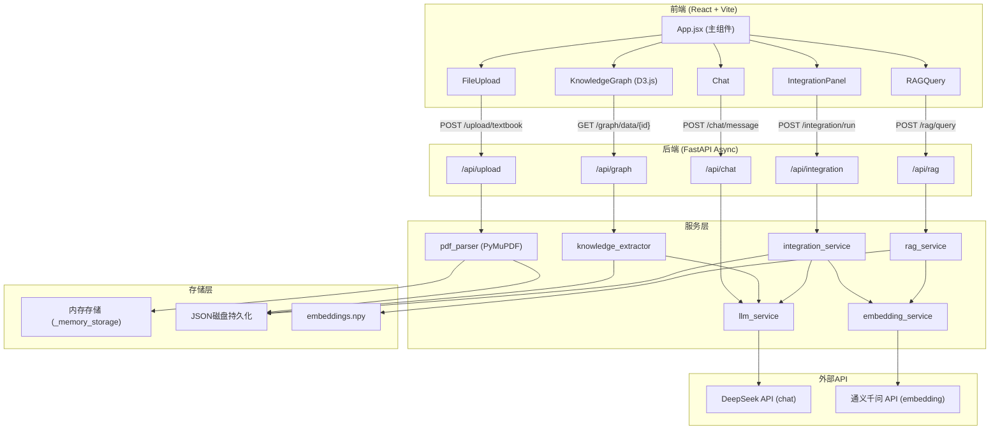

# 系统设计文档

## 1. 系统架构图



---

## 2. 数据流

系统的核心数据流分为六个阶段：**上传 -> 解析 -> 知识提取 -> 图谱构建 -> 跨教材整合 -> RAG问答**。

### 2.1 教材上传与解析

```
用户选择文件 (PDF/MD/TXT)
  |
  v
POST /api/upload/textbook (multipart/form-data)
  |
  v
文件保存到磁盘 (data/uploads/ 或系统临时目录)
  |
  v
根据文件类型分发处理:
  ├── PDF: PyMuPDF 逐页解析，正则匹配章节标题 (第X章/节/篇)
  ├── MD:  整体作为单章节
  └── TXT: 整体作为单章节
  |
  v
生成结构化 Textbook 对象，同时写入:
  ├── 内存存储 (parsed_textbooks 字典，key=textbook_id)
  └── 磁盘 JSON (data/parsed/{textbook_id}.json)
  |
  v
返回 { textbook_id, filename, title, total_pages, total_chars, chapter_count }
```

**大文件上传流程**（超过 4MB）：
```
前端请求 presigned URL (POST /api/upload/presigned-url)
  -> 前端直传文件至 Vercel Blob
  -> POST /api/upload/textbook-url 携带 blob_url
  -> 后端下载文件并执行相同解析逻辑
```

### 2.2 知识提取

```
POST /api/graph/build/{textbook_id}?max_chapters=5
  |
  v
从内存/磁盘加载已解析的 Textbook
  |
  v
取前 max_chapters 个章节，并行调用 DeepSeek API:
  - 系统提示词: 医学知识提取专家角色
  - 输入: 章节内容 (截取前8000字符)
  - 输出: 严格的JSON格式 { nodes: [...], relations: [...] }
  |
  v
对每个章节的节点ID做全局重映射:
  原始ID -> {textbook_id}_node_{counter:03d}
  |
  v
验证关系的 source/target 是否存在于节点集合中
  |
  v
合并所有章节的节点和关系，写入:
  - 磁盘: data/graphs/{textbook_id}_graph.json
  - 返回图谱统计信息
```

**LLM 提取的节点结构**:
```json
{
  "id": "book_abc123_node_001",
  "name": "炎症",
  "definition": "机体对损伤因子的防御性反应...",
  "category": "核心概念|生理机制|病理变化|临床表现|治疗方法|解剖结构",
  "chapter": "第三章 炎症",
  "page": 45,
  "textbook_id": "book_abc123",
  "textbook_name": "病理学"
}
```

**关系类型**:
| 类型 | 含义 | 示例 |
|------|------|------|
| prerequisite | 前置依赖 | 细胞结构 -> 细胞功能 |
| parallel | 并列关系 | 红细胞 <-> 白细胞 |
| contains | 包含关系 | 免疫系统 -> 体液免疫 |
| applies_to | 应用关系 | 炎症理论 -> 临床诊断 |

### 2.3 跨教材整合

```
POST /api/integration/run
  |
  v
收集所有已构建图谱的节点 (跨教材)
  |
  v
批量调用通义千问 Embedding API (text-embedding-v4, 1024维)
  -> 节点文本 = "{name} {definition}"
  -> 每次最多20个节点
  |
  v
计算余弦相似度矩阵，筛选候选对:
  - 条件: 不同教材 且 相似度 > 0.75
  - 按相似度降序排列
  |
  v
每5对为一批，调用 DeepSeek LLM 判断:
  "这些知识点对是否应该合并？"
  -> 输出: should_merge / reason / merged_name / merged_definition
  |
  v
执行合并决策，生成最终节点列表
  |
  v
写入 data/integration/integration_result.json
  -> 包含: merged_nodes, decisions, stats
```

### 2.4 RAG 索引与查询

**索引构建**:
```
POST /api/rag/index
  |
  v
加载所有已解析教材
  -> 跳过已索引的教材 (增量构建)
  |
  v
文本分块 (chunk_size=600, overlap=80)
  -> 每个 chunk 记录: chunk_id, textbook_id, chapter_title, page_start, page_end
  |
  v
逐个调用通义千问 Embedding API
  -> 文本超过2000字符时截断
  -> 失败时使用零向量 [0.0] * 1024 作为兜底
  |
  v
合并到已有索引 (np.vstack)
  -> 持久化: data/index/embeddings.npy + data/chunks/chunks.json
```

**RAG 查询**:
```
POST /api/rag/query?question=什么是炎症反应
  |
  v
对 question 调用 Embedding API
  |
  v
与 embeddings_matrix 做余弦相似度，取 top-5
  |
  v
拼接检索结果为上下文:
  [来源1] 病理学 - 第三章 炎症\n{content}
  [来源2] 生理学 - 第五章 免疫\n{content}
  |
  v
调用 DeepSeek LLM:
  系统提示: "严格基于参考资料回答，每个论述注明来源"
  输入: 上下文 + 用户问题
  |
  v
返回 { answer, citations[], source_chunks[] }
```

### 2.5 对话交互

```
POST /api/chat/message
  body: { message: "...", history: [{role, content}, ...] }
  |
  v
加载当前整合结果作为上下文:
  - 整合统计 (原始/整合后/决策数)
  - 最近10条整合决策
  |
  v
调用 DeepSeek LLM (system_prompt 包含整合状态)
  |
  v
返回 { response, role: "assistant" }
```

---

## 3. 技术选型及理由

| 层级 | 技术 | 选择理由 |
|------|------|----------|
| **后端框架** | FastAPI + async | 原生异步支持，适合并发调用多个外部 API；自动生成 OpenAPI 文档；Pydantic 数据校验 |
| **前端框架** | React 18 + Vite | 组件化开发，Vite 极速热更新；生态成熟，适合单页应用 |
| **知识图谱可视化** | D3.js v7 | 力导向图布局灵活度最高；支持节点拖拽、缩放、搜索高亮；可自定义关系样式 |
| **LLM 调用** | DeepSeek API (deepseek-chat) | 中文理解能力强；通过 OpenAI 兼容接口调用；temperature=0.3 保证输出稳定性 |
| **向量嵌入** | 通义千问 text-embedding-v4 | 输出 1024 维向量；中文语义理解优秀；通过 HTTP API 调用，无本地依赖 |
| **PDF 解析** | PyMuPDF (fitz) | 逐页提取文本，支持正则匹配章节标题；处理中文 PDF 表现良好 |
| **数值计算** | NumPy | 余弦相似度矩阵计算；向量持久化为 .npy 格式；轻量无外部依赖 |
| **HTTP 客户端** | httpx (async) | 异步请求外部 API；支持 timeout 和 follow_redirects |
| **数据持久化** | JSON 文件 + 内存字典 | 无数据库依赖，部署简单；内存存储保证读取速度，JSON 文件保证重启后数据不丢失 |
| **状态管理** | React useState/useEffect | 组件级状态足够；无需引入 Redux 等重型方案 |
| **数据请求** | axios | 拦截器、超时配置、错误处理统一 |

---

## 4. API 接口一览

### 4.1 教材管理 (`/api/upload`)

#### POST /api/upload/textbook

上传教材文件（PDF/MD/TXT），4MB 以内。

**请求**: `multipart/form-data`
```
file: <二进制文件>
```

**响应示例**:
```json
{
  "textbook_id": "book_a1b2c3d4",
  "filename": "病理学.pdf",
  "title": "病理学",
  "total_pages": 350,
  "total_chars": 285000,
  "chapter_count": 12,
  "status": "parsed"
}
```

#### GET /api/upload/textbooks

获取已解析的教材列表。

**响应示例**:
```json
[
  {
    "textbook_id": "book_a1b2c3d4",
    "filename": "病理学.pdf",
    "title": "病理学",
    "total_pages": 350,
    "total_chars": 285000,
    "chapter_count": 12
  }
]
```

#### GET /api/upload/textbook/{textbook_id}

获取单本教材的完整详情（包含所有章节内容）。

### 4.2 知识图谱 (`/api/graph`)

#### POST /api/graph/build/{textbook_id}

为指定教材构建知识图谱，通过 LLM 提取知识点和关系。

**查询参数**: `max_chapters` (int, 默认 5)

**响应示例**:
```json
{
  "textbook_id": "book_a1b2c3d4",
  "textbook_name": "病理学",
  "stats": {
    "total_nodes": 45,
    "total_relations": 38,
    "chapters_processed": 5
  },
  "nodes_count": 45,
  "relations_count": 38
}
```

#### GET /api/graph/data/{textbook_id}

获取教材的知识图谱数据（节点 + 关系），用于 D3.js 渲染。

**响应示例**:
```json
{
  "textbook_id": "book_a1b2c3d4",
  "textbook_name": "病理学",
  "nodes": [
    {
      "id": "book_a1b2c3d4_node_001",
      "name": "炎症",
      "definition": "机体对损伤因子所发生的以防御为主的反应",
      "category": "核心概念",
      "chapter": "第三章 炎症",
      "page": 45,
      "textbook_id": "book_a1b2c3d4",
      "textbook_name": "病理学"
    }
  ],
  "relations": [
    {
      "source": "book_a1b2c3d4_node_001",
      "target": "book_a1b2c3d4_node_002",
      "relation_type": "prerequisite",
      "description": "掌握炎症概念是学习炎症机制的前提"
    }
  ],
  "stats": { "total_nodes": 45, "total_relations": 38, "chapters_processed": 5 }
}
```

#### GET /api/graph/list

获取所有教材的图谱概览。

**响应示例**:
```json
[
  {
    "textbook_id": "book_a1b2c3d4",
    "title": "病理学",
    "has_graph": true,
    "nodes_count": 45,
    "relations_count": 38
  }
]
```

### 4.3 RAG 问答 (`/api/rag`)

#### POST /api/rag/index

为所有已解析教材构建向量索引（增量式，跳过已索引教材）。

**响应示例**:
```json
{
  "status": "ok",
  "count": 120,
  "new": 45
}
```

`status` 取值: `"ok"` (成功构建), `"already_indexed"` (已全部索引), `"no_chunks"` (无有效分块)

#### POST /api/rag/query?question=...

基于教材内容的 RAG 问答，自动检索相关片段并由 LLM 生成带引用的答案。

**请求**:
```
POST /api/rag/query?question=什么是炎症反应
```

**响应示例**:
```json
{
  "answer": "炎症反应是机体对损伤因子的防御性反应 [病理学, 第三章 炎症]。其基本病理变化包括变质、渗出和增生 [病理学, 第三章 炎症]。",
  "citations": [
    {
      "textbook": "病理学",
      "chapter": "第三章 炎症",
      "page": 45,
      "relevance_score": 0.89,
      "content_preview": "炎症是具有血管系统的活体组织对损伤因子所发生的以防御为主的反应..."
    }
  ],
  "source_chunks": ["炎症是具有血管系统的活体组织...", "..."]
}
```

#### GET /api/rag/status

获取当前向量索引的状态。

**响应示例**:
```json
{
  "indexed_textbooks": 3,
  "total_chunks": 120,
  "is_indexed": true
}
```

### 4.4 跨教材整合 (`/api/integration`)

#### POST /api/integration/run

执行跨教材知识整合。需要至少 2 本教材的图谱已构建。

**响应示例**:
```json
{
  "stats": {
    "original": 150,
    "merged": 98,
    "decisions_count": 22,
    "compression_ratio": 0.653
  },
  "decisions_count": 22,
  "decisions": [
    {
      "decision_id": "merge_000",
      "action": "merge",
      "affected_nodes": ["book_a1_node_003", "book_b2_node_007"],
      "result_node": "book_a1_node_003",
      "reason": "两个知识点均描述炎症的定义和基本机制，内容高度重叠",
      "confidence": 0.92
    }
  ]
}
```

#### GET /api/integration/result

获取最近一次整合的完整结果。

#### GET /api/integration/report

获取格式化的整合报告（Markdown 格式），包含统计摘要、决策明细和教学完整性说明。

### 4.5 对话交互 (`/api/chat`)

#### POST /api/chat/message

发送对话消息，LLM 会结合当前整合状态进行回答。

**请求体**:
```json
{
  "message": "为什么把《生理学》里的炎症和《病理学》里的炎症反应合并了？",
  "history": [
    { "role": "user", "content": "之前的消息" },
    { "role": "assistant", "content": "之前的回复" }
  ]
}
```

**响应示例**:
```json
{
  "response": "这两个知识点虽然来自不同教材，但核心定义高度重叠...",
  "role": "assistant"
}
```

#### POST /api/chat/adjust

调整整合决策（修改 action 或 reason）。

**查询参数**: `decision_id`, `action`, `reason`

---

## 5. 数据存储设计

### 5.1 磁盘目录结构

```
backend/data/
  ├── uploads/              # 上传的原始文件
  │   ├── a1b2c3d4.pdf
  │   └── e5f6g7h8.md
  ├── parsed/               # 解析后的教材 JSON
  │   ├── book_a1b2c3d4.json
  │   └── book_e5f6g7h8.json
  ├── graphs/               # 知识图谱 JSON
  │   ├── book_a1b2c3d4_graph.json
  │   └── book_e5f6g7h8_graph.json
  ├── chunks/               # RAG 文本分块
  │   └── chunks.json
  ├── index/                # 向量索引
  │   └── embeddings.npy
  └── integration/          # 整合结果
      └── integration_result.json
```

### 5.2 内存存储

系统使用全局字典 `_memory_storage` 作为主要数据存储，适用于无状态的 Serverless 环境：

```python
_memory_storage = {
    "parsed_textbooks": {
        "book_a1b2c3d4": { ... textbook dict ... },
        "book_e5f6g7h8": { ... textbook dict ... }
    }
}
```

辅助缓存：
- `_graph_cache` (graph_service.py): 图谱数据的内存缓存字典
- `embeddings_matrix` (rag_service.py): NumPy 数组，向量索引的内存表示
- `chunks_data` (rag_service.py): 分块数据列表

### 5.3 启动时数据恢复

应用启动时 (`startup` 事件) 执行以下操作：
1. 清空内存中的 `parsed_textbooks` 和 `graphs`
2. `preload_textbooks()`: 从 `data/parsed/` 目录加载 JSON 到内存
3. `preload_graphs()`: 从 `data/graphs/` 目录加载图谱到 `_graph_cache`
4. `load_index()`: 从 `data/index/embeddings.npy` 和 `data/chunks/chunks.json` 恢复 RAG 索引

### 5.4 数据持久化策略

| 数据类型 | 内存 | 磁盘 | 说明 |
|----------|------|------|------|
| 教材解析结果 | `_memory_storage["parsed_textbooks"]` | `data/parsed/*.json` | 双写，读取优先内存 |
| 知识图谱 | `_graph_cache` | `data/graphs/*_graph.json` | 双写，读取优先缓存 |
| 向量索引 | `embeddings_matrix` (NumPy) | `data/index/embeddings.npy` | 启动时加载，构建时追加 |
| 文本分块 | `chunks_data` (list) | `data/chunks/chunks.json` | 启动时加载，构建时追加 |
| 整合结果 | 无 | `data/integration/integration_result.json` | 仅磁盘，每次读取从文件加载 |

---

## 6. 前端架构

### 6.1 组件树

```
App.jsx (顶层状态管理)
├── FileUpload.jsx          # 左侧栏：教材上传与管理
├── KnowledgeGraph.jsx      # 中央区域：D3.js 力导向图
├── IntegrationPanel.jsx    # 右侧面板 - 整合标签页
├── RAGQuery.jsx            # 右侧面板 - RAG问答标签页
└── Chat.jsx                # 右侧面板 - 对话标签页
```

### 6.2 布局结构

系统采用三栏布局：

| 区域 | 宽度 | 内容 |
|------|------|------|
| 左侧栏 (sidebar) | 可折叠 | FileUpload 组件 + RAG 索引状态 + 构建按钮 |
| 中央区域 (center-panel) | 弹性 | KnowledgeGraph 力导向图 |
| 右侧面板 (right-panel) | 固定 | Tab 切换: 整合 / RAG问答 / 对话 |

### 6.3 App.jsx 状态管理

App 组件持有全局状态，通过 props 向下传递：

| 状态 | 类型 | 说明 |
|------|------|------|
| `textbooks` | `array` | 已解析的教材列表 |
| `graphs` | `object` | 各教材的图谱数据 `{ textbookId: graphData }` |
| `allGraphData` | `{ nodes, links }` | 合并后的全部图谱数据，传给 D3.js |
| `selectedNode` | `object \| null` | 当前选中的节点，传递给 IntegrationPanel 显示详情 |
| `activeTab` | `string` | 当前激活的右侧标签页 (`integration` / `rag` / `chat`) |
| `ragStatus` | `object` | RAG 索引状态 `{ indexed_textbooks, total_chunks }` |
| `integrationResult` | `object \| null` | 整合结果 |
| `loading` | `string` | 当前加载状态标识 (如 `"uploading"`, `"graph-book_001"`, `"index"`, `"integration"`) |
| `sidebarCollapsed` | `boolean` | 左侧栏是否折叠 |

### 6.4 核心组件职责

#### FileUpload.jsx

- 拖拽/点击上传文件，支持 PDF/MD/TXT
- 展示教材列表，支持全选/取消
- 单个/批量构建知识图谱
- 通过 checkbox 选择要操作的教材

#### KnowledgeGraph.jsx

- 使用 D3.js 力导向图渲染知识网络
- 支持缩放 (scaleExtent: 0.1~4)、拖拽节点
- 节点颜色区分教材来源，关系线样式区分关系类型
- 搜索框实时高亮匹配节点
- 点击节点触发 `onNodeSelect` 回调
- 图例展示关系类型和教材颜色映射

**关系线样式**:
| 关系类型 | 颜色 | 线型 |
|----------|------|------|
| prerequisite (前置依赖) | 红色 `#ef4444` | 虚线 5,5 |
| parallel (并列关系) | 绿色 `#22c55e` | 实线 |
| contains (包含关系) | 橙色 `#f59e0b` | 点线 3,3 |
| applies_to (应用场景) | 紫色 `#8b5cf6` | 长虚线 8,4 |

#### IntegrationPanel.jsx

- 触发跨教材整合
- 展示整合统计（原始知识点数、整合后数量、决策数、压缩比）
- 展示整合决策列表（action 类型、理由、置信度）
- 当选中图谱节点时，显示节点详情（名称、分类、定义、来源教材、章节、页码）

#### RAGQuery.jsx

- 输入框 + 查询按钮，支持 Enter 快捷键
- 展示 LLM 生成的答案
- 展示引用来源列表（教材、章节、页码、相关度、内容预览）

#### Chat.jsx

- 对话式界面，支持多轮对话
- 消息历史持久化到 `localStorage`
- LLM 自动加载整合状态作为上下文
- 提供示例问题快速输入
- 支持清空对话历史

### 6.5 API 通信

前端通过 `axios` 与后端通信，基础配置：

```javascript
const API_BASE = import.meta.env.VITE_API_BASE || '/api'
// 超时: 120000ms (2分钟)
```

前端直接使用 `axios` 发起请求（非封装的 api 实例），API 基础路径通过环境变量 `VITE_API_BASE` 配置。

### 6.6 数据合并策略

当多个教材的图谱数据加载后，前端 `mergeAllGraphs()` 函数将它们合并为统一的 `{ nodes, links }` 结构：

- 每本教材分配一个固定颜色（循环使用 7 色调色板）
- 节点附加 `color` 和 `size` 属性
- 关系映射为 `{ source, target, type }` 格式
- 合并后的数据直接传入 `KnowledgeGraph` 组件渲染
